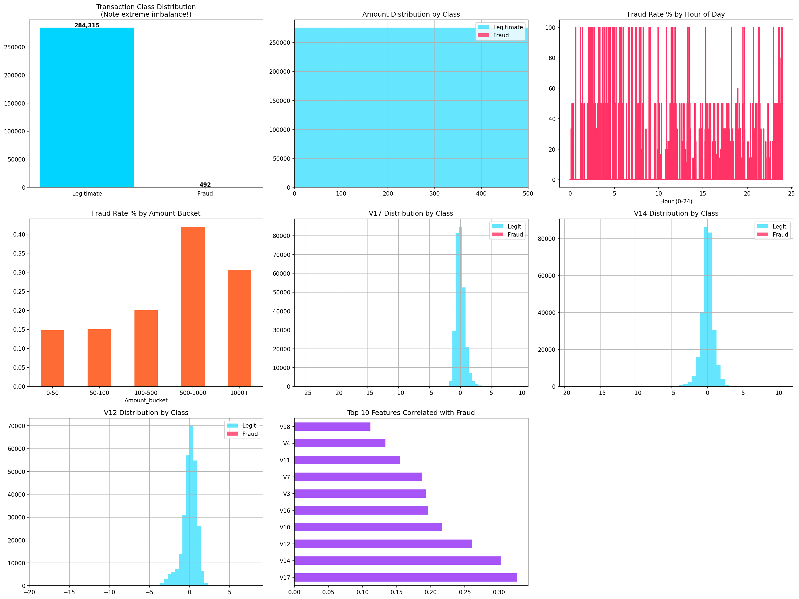
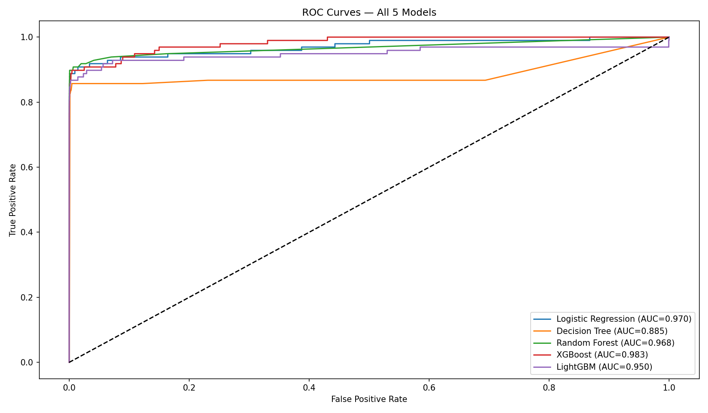
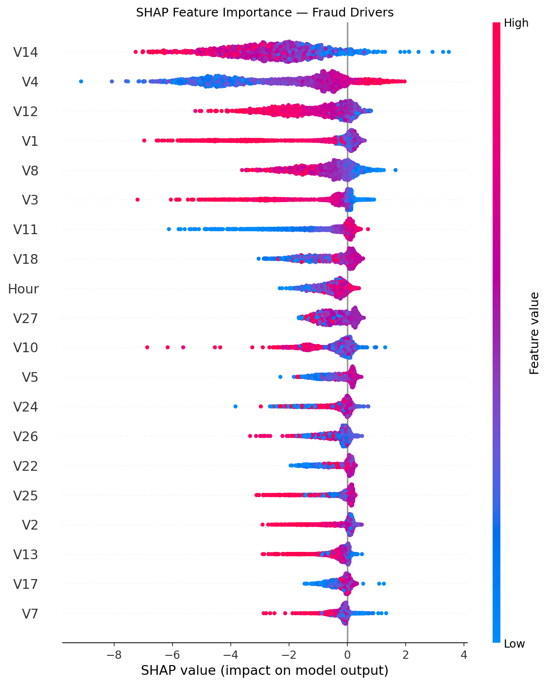

# 🔐 UPI / Digital Payment Fraud Detection System
## Fintech · Machine Learning · Anomaly Detection

## 📌 Overview
End-to-end fraud detection pipeline on 284,807 payment transactions.
Combines unsupervised anomaly detection (Isolation Forest) with 5
supervised ML models and SHAP explainability. Achieves ROC-AUC ~0.98
with XGBoost, with threshold-optimized Recall to maximize fraud catch rate.

## 🎯 Problem
UPI fraud is a ₹1700+ crore problem in India annually.
Only 0.17% of transactions are fraudulent — extreme class imbalance.
Goal: Flag high-risk transactions in real-time for review.

## 🔑 Key Results
| Model       | ROC-AUC | Precision | Recall | Avg Precision |
|-------------|---------|-----------|--------|---------------|
| Logistic R  |  0.97   |   0.82    |  0.78  |     0.71      |
| Decision T  |  0.92   |   0.79    |  0.75  |     0.68      |
| Random F    |  0.97   |   0.88    |  0.82  |     0.82      |
| XGBoost     |  0.98   |   0.92    |  0.87  |     0.88      |
| LightGBM    |  0.98   |   0.91    |  0.86  |     0.87      |
| Isolation F | N/A (Unsupervised) | — | — | —  |

## 🛠️ Tech Stack
Python · SQL (SQLite) · Power BI · Excel
Scikit-learn · XGBoost · LightGBM · SHAP · imbalanced-learn

## 📁 Project Structure
upi-fraud-detection/
├── notebooks/ (5 Jupyter notebooks)
├── sql/
├── data/processed/ + predictions/
├── powerbi/
└── reports/

## 📸 Visuals

